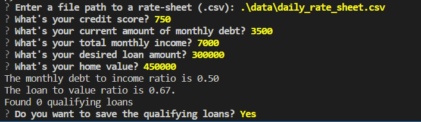

# Challenge II | Fintech 
---
This project is the second weekly challenge for Fintech, the challenge deals with Readme.md files edition, modules and Git basic commands

The program reads a list of parameters for applying for a bank loan given a set of parameters.

Included in [Daily Rate Sheet](./data/daily_rate_sheet.csv)

## Technologies

The main language is Python, with the following auxiliary modules/libraries.
Python version is 3.7, developed in an independent conda virtual environment

### csv
This module handles csv parsing, reading and writing

### fire
This modules abstracts the interface between the command line and the internal python script functions

### questionary
This module generates an interactive user input that makes the terminal interface more intuitive.

### pathlib
This module helps abstracting the OS discrepancies between folder structures and files.

---

## Installation Guide

For instalation the latest version of Python is recommended.

[Python](https://www.python.org)

### Install the external libraries

```
pip install questionary
pip install csv
pip install path
pip install fire
```


### Clone repository`
`git clone https://github.com/lumiroga/Fintech_Challenge2.git`


---

## Usage

Open the terminal

Go to solution folder in your local computer

`cd ./Fintech_Challenge2`

`python app.py`

The following commands will show:



Type your inputs and select the name and location for your file

---

## Contributors

[lumiroga](https://github.com/lumiroga)

---

## License

* mpl-2.0 | Mozilla Public License 2.0

When you share a project on a repository, especially a public one, it's important to choose the right license to specify what others can and can't with your source code and files. Use this section to include the license you want to use.
